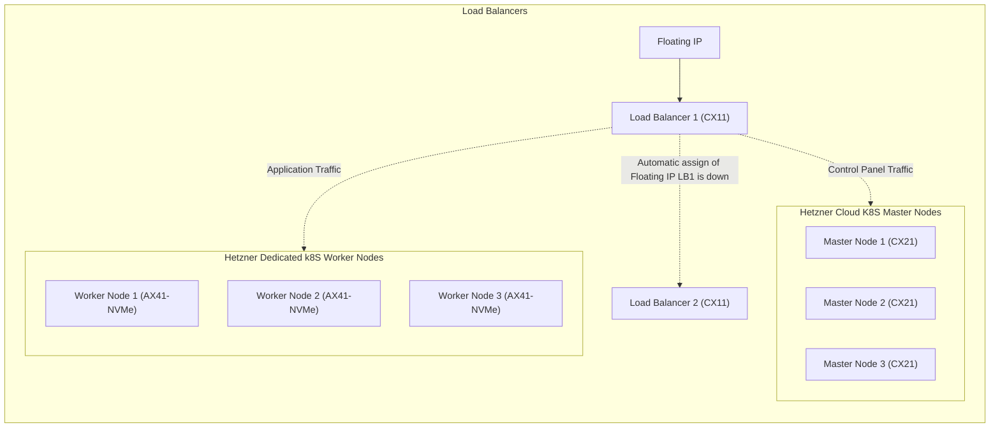

# 🤖 Hetzner Kubernetes Cluster With Load Balancers
This repository contains the building blocks to create your own highly available kubernetes cluster with custom load balancers at Hetzner.

## 📚 Quick History
I've always felt that the price of running a medium sized Kubernetes Cluster in the public cloud is to high. I do understand that there is a lot included in the price when you are running it in the public cloud, so a cheaper alternative like this might not be for everyone. But if you are like me and love to tinker with stuff, this might be for you.

## 💽 Infrastructure Overview
Your needs might be different, and you can easily change the configuration to fit your needs.

The basic idea is that we are going to reserve a floating IP adress that is going to be our main entrypoint, always. This floating IP is then going to be assigned to our main load balancer, and if that load balancer goes down, it will automatically be assigned to the other load balancer. This way we can have a highly available entrypoint to our cluster.

The load balancers are then going to be redirecting control panel traffic to our master nodes, and application traffic to our worker nodes. This way we can have a highly available cluster, with a highly available entrypoint.

> A good change to this setup would be to have one load balancer for control panel traffic, and one for application traffic. This way you can scale your application traffic load balancer up and down depending on your needs. This is not included in this guide (to keep the budget down), but it is something you can easily add yourself.

## 🫰 Price comparison
The prices are calculated based on the prices at the time of writing this guide. December 2023.

### Breakdown of the prices from Hetzner
Hetzner has a lot simpler pricing than the public cloud providers. There are some limitations on bandwidth for VM's, but mostly unlimited for root servers. So the price is going to be a lot more accurate than the public cloud providers.

| Node | Machine Type | Price per month | Price per year |
| --- | --- | --- | --- |
| Load Balancer 1 | CX11 | 4.74€ | 56.88€ |
| Load Balancer 2 | CX11 | 4.74€ | 56.88€ |
| Master Node 1 | CX21 | 6.69€ | 80.28€ |
| Master Node 2 | CX21 | 6.69€ | 80.28€ |
| Master Node 3 | CX21 | 6.69€ | 80.28€ |
| Worker Node 1 | AX41-NVMe | 46.63€ | 559.56€ |
| Worker Node 2 | AX41-NVMe | 46.63€ | 559.56€ |
| Worker Node 3 | AX41-NVMe | 46.63€ | 559.56€ |
| Floating IP | - | 3.75€ | 45€ |
| **Total** | - | **173.19€** | **2,078.28€** |

| Resource | Amount |
| --- | --- |
| vCPU Cores | 44 |
| GB RAM | 208 |
| GB Storage | ~3 160 |

### Breakdown of the prices from Google Cloud
I've created a similar setup in Google Cloud with their pricing calculator. Their pricing is based a lot on usage, and there is always extra costs like networking, storage and so on. So the price is not going to be 100% accurate, but it will give you a good idea of the price difference.

Another thing to note here is that the master nodes are not included in the price. This is because Google Cloud does not charge for the master nodes, but they do charge for the control plane.

| Node | Machine Type | Price per month | Price per year | Notes |
| --- | --- | --- | --- | --- |
| Load Balancer | Cloud Load Balancer | 65.72€ | 788,64€ | I chose 10 Forwarding rules and 1GB ingoing/outgoing traffic. |
| Worker Nodes | n1-standard-16 | 1,861.05€ | 22,332.6€ | I chose 3 nodes, 1TB boot disks and sustained discount |
| **Total** | - | **1 926,77€** | **23 121,24€** | - |

| Resource | Amount |
| --- | --- |
| vCPU Cores | 48 |
| GB RAM | 180 |
| GB Storage | ~3 000 |

### Conclusion
As you can see, the price of all this power is available for a 10th of the price. The price difference is huge, and you can save a lot of money by running your own cluster. The downside is that you have to manage the servers yourself, but this might be worth it for some.

## 📝 Prerequisites
Before you start, you should have the following:
- Bought the servers listed 
- Created a Hetzner API Token (for moving the floating IP)
- Have a domain name that you can use for your cluster

## 🚀 Getting Started
This guide is not going to be a perfect step by step guide on how to set everything up. It is more of a guide on how to get started, and what you need to do to get it working. I will try to explain everything as good as I can, but if you have any questions, feel free to open an issue.

### Clone the repository
The first thing you need to do is to clone this repository to your local machine. This way you can modify the configuration files to fit your infrastructure.

### Prepare the servers and DNS
The first thing you need to do is to set up the servers and install Ubuntu 22.04 on them. For the VM's this is done easily through the Hetzner Cloud Console. Make sure to:
- Add your SSH key to the servers so you can access them later.
- Add the servers to a private network so they can communicate with each other.
- Add the servers to a project so you can easily manage them.

Do this for two Load Balancers and three Master Nodes.

For the Worker Nodes, you will need to buy the root servers from Hetzner. This is done through their website, and you can choose the AX41-NVMe model. This could take a couple hours or even days. When you get the servers, make sure to not do anything else than adding your SSH key and a vSwitch to connect your servers to the same private network as your VMs. The ansible script is going to take care of the rest.

After you are done seting up your servers, you should create some DNS records to make it easier to access your cluster later. I recommend creating the following records:
- `lb.<domain>` -> `<floating-ip>`
- `lb1.<domain>` -> `<load-balancer-1-public-ip>`
- `lb2.<domain>` -> `<load-balancer-2-public-ip>`
- `master1.<domain>` -> `<master1-public-ip>`
- `master2.<domain>` -> `<master2-public-ip>`
- `master3.<domain>` -> `<master3-public-ip>`
- `worker1.<domain>` -> `<worker1-public-ip>`
- `worker2.<domain>` -> `<worker2-public-ip>`
- `worker3.<domain>` -> `<worker3-public-ip>`

Make sure to access your servers with ssh through the domain names, that way you can accept the ssh fingerprint and not have to worry about it later.

### Setup Load Balancers
Navigate to [./load-balancers](./load-balancers/) and follow the instructions in the README.md file. This will set up your loda balancers so the first master node can be installed with the right routes later.

### Prepare the Worker Nodes
Navigate to [./worker-nodes](./worker-nodes/) and follow the instructions in the README.md file. This will set up your worker nodes so they are ready to be added to the cluster later.

### Install Kubernetes
Navigate to [./kubernetes](./kubernetes/) and follow the instructions in the README.md file. This will install Kubernetes on your master nodes and worker nodes.

### Tune to your needs
Now you have a working Kubernetes cluster with load balancers. You can now tune it to your needs. You can add more worker nodes, change the machine types, add more load balancers and so on. The sky is the limit.

I recommend checking out:
- [rook.io](https://rook.io/)
- [traefik.io/traefik](https://traefik.io/traefik/)
- [cert-manager.io](https://cert-manager.io/)

## 📚 Resources
- [docs.hetzner.com](https://docs.hetzner.com/)
- [docs.ansible.com](https://docs.ansible.com/)
- [haproxy.com/documentation](https://www.haproxy.com/documentation/)
- [keepalived.readthedocs.io](https://keepalived.readthedocs.io/en/latest/introduction.html)